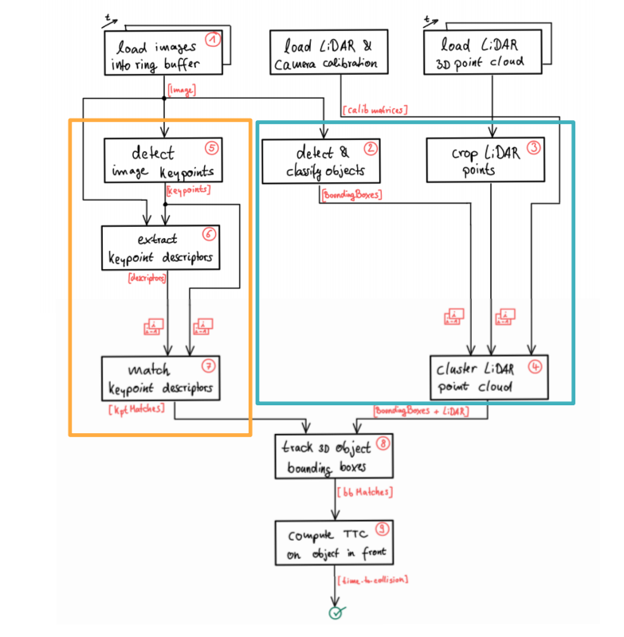
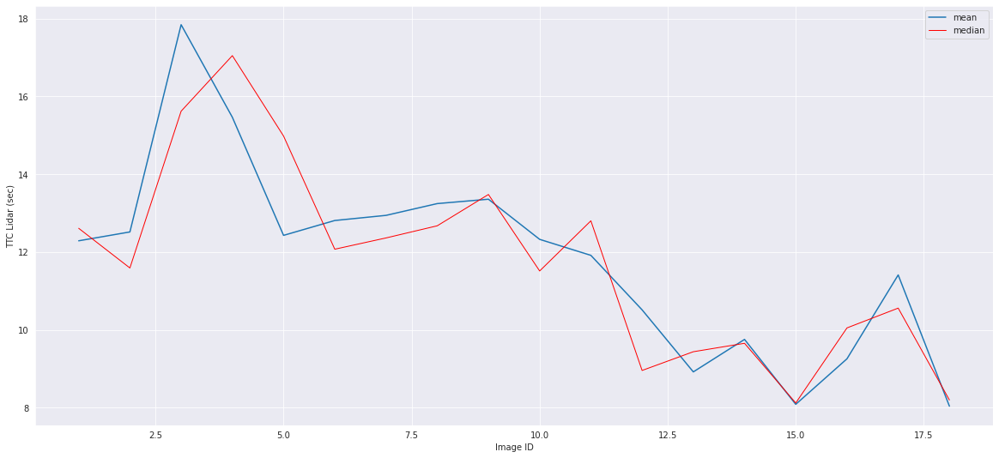
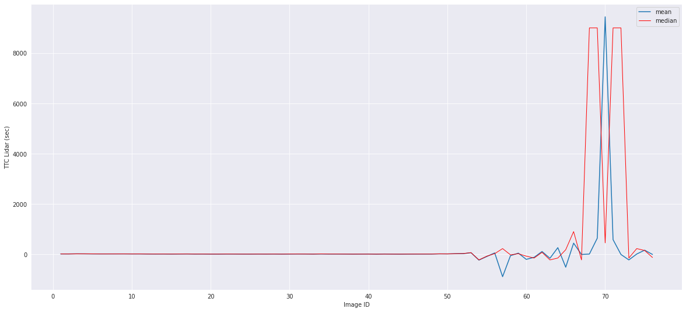
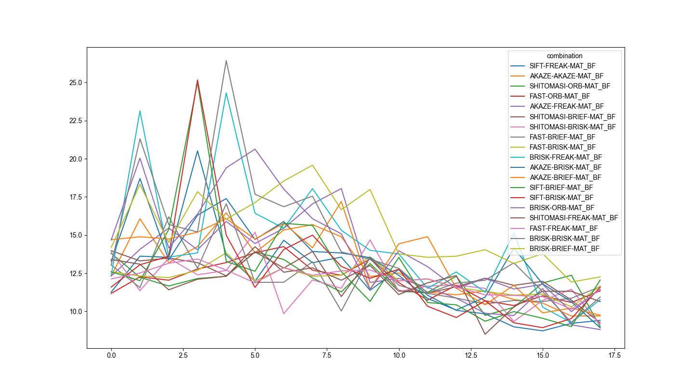
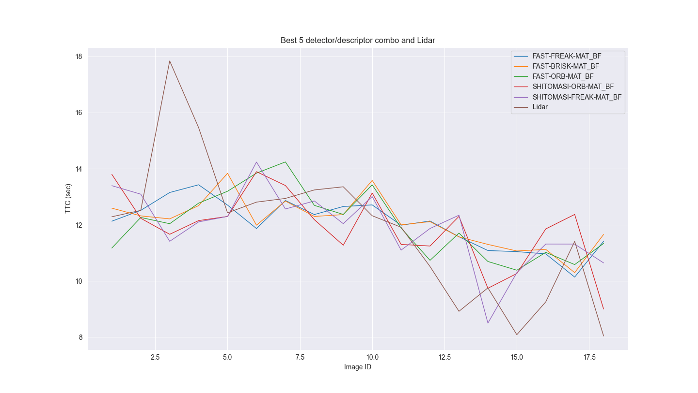

# 3D Object Tracking - Time to Collision Estimation

This project uses yolo object detection, lidar point clouds and keypoint matches and combines the result from all 3 techniques to generate a time to collision estimation.

## FP.1 Match 3D Objects
In this step, the inputs are bounding boxes of car objects detected by yolo and keypoint matcheds by selected detector/descriptor combo. The expected output which is to be used by next pipeline is a map of the IDs of best matching bounding boxes from previous image frame to current image frame.

In the implementation we first iterate through all matches, find out all possible bounding box mappings from current image frame to previous image frame and store the intermediate result in a `multimap` container. Here we use the bounding box ID of current frame as key and the ID of previous frame as value.

Next we iterate through all bounding boxes in the current frame and simply count which current-previous bouding box mapping. We then insert this mapping pair to the return data container

## FP.2 Compute Lidar-based TTC
In this step, the inputs are lidar points of the best patch bounding box pairs from FP.1, i.e. bounding box pairs of previous and current frame. Also framerate was provided to calculate ego vehicle speed.

The idea is to use what the graph below shows and calculate TTC using these measurements: `TTC = d1 * dt / (d0 - d1)`. In the implementation we first filter out points that are not in the same lane of our ego car. Also we implemented both taking the average and the median y value of lidar points as our distance estimation between ego car and the car in front of it.

## FP.3 Associate Keypoint Correspondences with Bounding Boxes
The inputs of this step are keypoints of previous frame, keypoints of current frame, keypoint matches and the bounding boxes of current frame. The goal is to associate a given bounding box with the keypoints it contains.

In the implementation, we first iterate through all matches and calculate the distance between query (previous frame) and train (current frame) keypoints for those whose train keypoints are inside the bounding box. Then we associate matches for those keypoints within one-sigma distances between query and train keypoint to the bounding box.

## FP.4 Compute Camera-based TTC
The inputs of this step are keypoints of previous frame, keypoints of current frame, keypoint matches and frame rate for calcluating ego car speed. Using the relationships shown in the graph below, we can compute TTC by using `TTC = -dt / (1 - distance_ration)`.

## FP.5 Performance Evaluation 1 - Lidar TTC
The results seem fine for the first 18 frames. However, if we check all 78 frames you can see the TTC is unusable, as shown in the graph below. This is because the ego car and the car in front of it is stationary starting from frame ~55. To mitigate this we need to have vehicle speed as an input, so that we don't calcalate TTC but showing it as say `inf`.

## FP.6 Performance Evaluation 2 - Camera TTC

Because we do not have the ground truth data of TTC, here we naively calculate the standard deviaton of the TTCs of the first 18 frames using various detector/descriptor combo.

| combination | stddev |
|------------ | ------ |
| FAST-FREAK-MAT_BF   |      0.867190 |
| FAST-BRISK-MAT_BF   |      0.872242 |
| FAST-ORB-MAT_BF     |      1.170383 |
| SHITOMASI-ORB-MAT_BF |     1.310154 |
| SHITOMASI-FREAK-MAT_BF |   1.315518 |
| SHITOMASI-BRIEF-MAT_BF  |  1.316237 |
| SHITOMASI-BRISK-MAT_BF  |  1.662925 |
| FAST-BRIEF-MAT_BF    |     1.902749 |
| AKAZE-AKAZE-MAT_BF    |    2.207920 |
| AKAZE-BRIEF-MAT_BF    |    2.382275 |
| BRISK-BRIEF-MAT_BF    |    2.383877 |
| AKAZE-BRISK-MAT_BF    |    2.615776 |
| AKAZE-FREAK-MAT_BF    |    2.773019 |
| SIFT-FREAK-MAT_BF     |    2.830894 |
| BRISK-ORB-MAT_BF      |    3.288177 |
| SIFT-BRISK-MAT_BF     |    3.661956 |
| SIFT-BRIEF-MAT_BF     |    3.711426 |
| BRISK-FREAK-MAT_BF    |    4.045523 |
| BRISK-BRISK-MAT_BF    |    4.183313 |

### Result of All Detector/Descriptor Combo

### Result of The Top 5 Combo and Lidar TTC

## Dependencies for Running Locally
* cmake >= 2.8
  * All OSes: [click here for installation instructions](https://cmake.org/install/)
* make >= 4.1 (Linux, Mac), 3.81 (Windows)
  * Linux: make is installed by default on most Linux distros
  * Mac: [install Xcode command line tools to get make](https://developer.apple.com/xcode/features/)
  * Windows: [Click here for installation instructions](http://gnuwin32.sourceforge.net/packages/make.htm)
* Git LFS
  * Weight files are handled using [LFS](https://git-lfs.github.com/)
* OpenCV >= 4.1
  * This must be compiled from source using the `-D OPENCV_ENABLE_NONFREE=ON` cmake flag for testing the SIFT and SURF detectors.
  * The OpenCV 4.1.0 source code can be found [here](https://github.com/opencv/opencv/tree/4.1.0)
* gcc/g++ >= 5.4
  * Linux: gcc / g++ is installed by default on most Linux distros
  * Mac: same deal as make - [install Xcode command line tools](https://developer.apple.com/xcode/features/)
  * Windows: recommend using [MinGW](http://www.mingw.org/)

## Basic Build Instructions

1. Clone this repo.
2. Make a build directory in the top level project directory: `mkdir build && cd build`
3. Compile: `cmake .. && make`
4. Run it: `./3D_object_tracking`.
